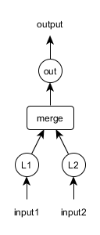
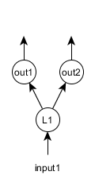

# Building Complex Network Architectures with Computation Graph

This page describes how to build more complicated networks, using DL4J's Computation Graph functionality.

***IMPORTANT: The ComputationGraph model is NOT available in DL4J 0.4-rc3.8 or earlier. It will be available in version 0.4-rc3.9 or later, as well as in the current [snapshot versions of DL4J](http://deeplearning4j.org/snapshot).***


**Contents**

* [Overview of the Computation Graph](#overview)
* [Computation Graph: Some Example Use Cases](#usecases)
* [Configuring a ComputationGraph network](#config)
  * [Types of Graph Vertices](#vertextypes)
  * [Example 1: Recurrent Network with Skip Connections](#rnnskip)
  * [Example 2: Multiple Inputs and Merge Vertex](#multiin)
  * [Example 3: Multi-Task Learning](#multitask)
  * [Automatically Adding PreProcessors and Calculating nIns](#preprocessors)
* [Training Data for ComputationGraph](#data)
  * [RecordReaderMultiDataSetIterator Example 1: Regression Data](#rrmdsi1)
  * [RecordReaderMultiDataSetIterator Example 2: Classification and Multi-Task Learning](#rrmdsi2)


## <a name="overview">Overview of Computation Graph</a>

DL4J has two types of networks comprised of multiple layers:

- The [MultiLayerNetwork](https://github.com/deeplearning4j/deeplearning4j/blob/master/deeplearning4j-core/src/main/java/org/deeplearning4j/nn/multilayer/MultiLayerNetwork.java), which is essentially a stack of neural network layers (with a single input layer and single output layer), and
- The [ComputationGraph](https://github.com/deeplearning4j/deeplearning4j/blob/master/deeplearning4j-core/src/main/java/org/deeplearning4j/nn/graph/ComputationGraph.java), which allows for greater freedom in network architectures


Specifically, the ComputationGraph allows for networks to be built with the following features:

- Multiple network input arrays
- Multiple network outputs (including mixed classification/regression architectures)
- Layers connected to other layers using a directed acyclic graph connection structure (instead of just a stack of layers)

As a general rule, when building networks with a single input layer, a single output layer, and an input->a->b->c->output type connection structure: MultiLayerNetwork is usually the preferred network. However, everything that MultiLayerNetwork can do, ComputationGraph can do as well - though the configuration may be a little more complicated.

## <a name="usecases">Computation Graph: Some Example Use Cases</a>

Examples of some architectures that can be built using ComputationGraph include:

- Multi-task learning architectures
- Recurrent neural networks with skip connections
- [GoogLeNet](http://arxiv.org/abs/1409.4842), a complex type of convolutional netural network for image classification
- [Image caption generation](http://arxiv.org/abs/1411.4555)
- [Convolutional networks for sentence classification](http://www.people.fas.harvard.edu/~yoonkim/data/emnlp_2014.pdf)
- [Residual learning convolutional neural networks](http://arxiv.org/abs/1512.03385)


## <a name="config">Configuring a Computation Graph</a>

### <a name="vertextypes">Types of Graph Vertices</a>

The basic idea is that in the ComputationGraph, the core building block is the [GraphVertex](https://github.com/deeplearning4j/deeplearning4j/blob/master/deeplearning4j-core/src/main/java/org/deeplearning4j/nn/graph/vertex/GraphVertex.java), instead of layers. Layers (or, more accurately the [LayerVertex](https://github.com/deeplearning4j/deeplearning4j/blob/master/deeplearning4j-core/src/main/java/org/deeplearning4j/nn/graph/vertex/impl/LayerVertex.java) objects), are but one type of vertex in the graph. Other types of vertices include:

- Input Vertices
- Element-wise operation vertices
- Merge vertices
- Subset vertices
- Preprocessor vertices

These types of graph vertices are described briefly below.

**LayerVertex**: Layer vertices (graph vertices with neural network layers) are added using the ```.addLayer(String,Layer,String...)``` method. The first argument is the label for the layer, and the last arguments are the inputs to that layer.
If you need to manually add an [InputPreProcessor](https://github.com/deeplearning4j/deeplearning4j/tree/master/deeplearning4j-core/src/main/java/org/deeplearning4j/nn/conf/preprocessor) (usually this is unnecessary - see next section) you can use the ```.addLayer(String,Layer,InputPreProcessor,String...)``` method.

**InputVertex**: Input vertices are specified by the ```addInputs(String...)``` method in your configuration. The strings used as inputs can be arbitrary - they are user-defined labels, and can be referenced later in the configuration. The number of strings provided define the number of inputs; the order of the input also defines the order of the corresponding INDArrays in the fit methods (or the DataSet/MultiDataSet objects).

**ElementWiseVertex**: Element-wise operation vertices do for example an element-wise addition or subtraction of the activations out of one or more other vertices. Thus, the activations used as input for  the ElementWiseVertex must all be the same size, and the output size of the elementwise vertex is the same as the inputs.

**MergeVertex**: The MergeVertex concatenates/merges the input activations. For example, if a MergeVertex has 2 inputs of size 5 and 10 respectively, then output size will be 5+10=15 activations. For convolutional network activations, examples are merged along the depth: so suppose the activations from one layer have 4 features and the other has 5 features (both with (4 or 5) x width x height activations), then the output will have (4+5) x width x height activations.

**SubsetVertex**: The subset vertex allows you to get only part of the activations out of another vertex. For example, to get the first 5 activations out of another vertex with label "layer1", you can use ```.addVertex("subset1", new SubsetVertex(0,4), "layer1")```: this means that the 0th through 4th (inclusive) activations out of the "layer1" vertex will be used as output from the subset vertex.

**PreProcessorVertex**: Occasionally, you might want to the functionality of an [InputPreProcessor](https://github.com/deeplearning4j/deeplearning4j/tree/master/deeplearning4j-core/src/main/java/org/deeplearning4j/nn/conf/preprocessor) without that preprocessor being associated with a layer. The PreProcessorVertex allows you to do this.

Finally, it is also possible to define custom graph vertices by implementing both a [configuration](https://github.com/deeplearning4j/deeplearning4j/blob/master/deeplearning4j-core/src/main/java/org/deeplearning4j/nn/conf/graph/GraphVertex.java) and [implementation](https://github.com/deeplearning4j/deeplearning4j/blob/master/deeplearning4j-core/src/main/java/org/deeplearning4j/nn/graph/vertex/GraphVertex.java) class for your custom GraphVertex.


### <a name="rnnskip">Example 1: Recurrent Network with Skip Connections</a>

Suppose we wish to build the following recurrent neural network architecture:


For the sake of this example, lets assume our input data is of size 5. Our configuration would be as follows:

```java
ComputationGraphConfiguration conf = new NeuralNetConfiguration.Builder()
        .learningRate(0.01)
        .graphBuilder()
        .addInputs("input") //can use any label for this
        .addLayer("L1", new GravesLSTM.Builder().nIn(5).nOut(5).build(), "input")
        .addLayer("L2",new RnnOutputLayer.Builder().nIn(5+5).nOut(5).build(), "input", "L1")
        .setOutputs("L2")	//We need to specify the network outputs and their order
        .build();

ComputationGraph net = new ComputationGraph(conf);
net.init();
```

Note that in the .addLayer(...) methods, the first string ("L1", "L2") is the name of that layer, and the strings at the end (["input"], ["input","L1"]) are the inputs to that layer.


### <a name="multiin">Example 2: Multiple Inputs and Merge Vertex</a>

Consider the following architecture:



Here, the merge vertex takes the activations out of layers L1 and L2, and merges (concatenates) them: thus if layers L1 and L2 both have has 4 output activations (.nOut(4)) then the output size of the merge vertex is 4+4=8 activations.

To build the above network, we use the following configuration:

```java
ComputationGraphConfiguration conf = new NeuralNetConfiguration.Builder()
        .learningRate(0.01)
        .graphBuilder()
        .addInputs("input1", "input2")
        .addLayer("L1", new DenseLayer.Builder().nIn(3).nOut(4).build(), "input1")
        .addLayer("L2", new DenseLayer.Builder().nIn(3).nOut(4).build(), "input2")
        .addVertex("merge", new MergeVertex(), "L1", "L2")
        .addLayer("out", new OutputLayer.Builder().nIn(4+4).nOut(3).build(), "merge")
        .setOutputs("out")
        .build();
```

### <a name="multitask">Example 3: Multi-Task Learning</a>

In multi-task learning, a neural network is used to make multiple independent predictions.
Consider for example a simple network used for both classification and regression simultaneously. In this case, we have two output layers, "out1" for classification, and "out2" for regression.



In this case, the network configuration is:

```java
ComputationGraphConfiguration conf = new NeuralNetConfiguration.Builder()
        .learningRate(0.01)
        .graphBuilder()
        .addInputs("input")
        .addLayer("L1", new DenseLayer.Builder().nIn(3).nOut(4).build(), "input")
        .addLayer("out1", new OutputLayer.Builder()
                .lossFunction(LossFunctions.LossFunction.NEGATIVELOGLIKELIHOOD)
                .nIn(4).nOut(3).build(), "L1")
        .addLayer("out2", new OutputLayer.Builder()
                .lossFunction(LossFunctions.LossFunction.MSE)
                .nIn(4).nOut(2).build(), "L1")
        .setOutputs("out1","out2")
        .build();
```

### <a name="preprocessors">Automatically Adding PreProcessors and Calculating nIns</a>

One feature of the ComputationGraphConfiguration is that you can specify the types of input to the network, using the ```.setInputTypes(InputType...)``` method in the configuration.

The setInputType method has two effects:

1. It will automatically add any [InputPreProcessor](https://github.com/deeplearning4j/deeplearning4j/tree/master/deeplearning4j-core/src/main/java/org/deeplearning4j/nn/conf/preprocessor)s as required. InputPreProcessors are necessary to handle the interaction between for example fully connected (dense) and convolutional layers, or recurrent and fully connected layers.
2. It will automatically calculate the number of inputs (.nIn(x) config) to a layer. Thus, if you are using the ```setInputTypes(InputType...)``` functionality, it is not necessary to to manually specify the .nIn(x) options in your configuration. This can simplify building some architectures (such as convolutional networks with fully connected layers). If the .nIn(x) is specified for a layer, the network will not override this when using the InputType functionality.


For example, if your network has 2 inputs, one being a convolutional input and the other being a feed-forward input, you would use ```.setInputTypes(InputType.convolutional(depth,width,height), InputType.feedForward(feedForwardInputSize))```


## <a name="data">Training Data for ComputationGraph</a>

There are two types of data that can be used with the ComputationGraph.

### DataSet and the DataSetIterator

The DataSet class was originally designed for use with the MultiLayerNetwork, however can also be used with ComputationGraph - but only if that computation graph has a single input and output array. For computation graph architectures with more than one input array, or more than one output array, DataSet and DataSetIterator cannot be used (instead, use MultiDataSet/MultiDataSetIterator).

A DataSet object is basically a pair of INDArrays that hold your training data. In the case of RNNs, it may also include masking arrays (see [this](http://deeplearning4j.org/usingrnns) for more details). A DataSetIterator is essentially an iterator over DataSet objects.

### MultiDataSet and the MultiDataSetIterator

MultiDataSet is multiple input and/or multiple output version of DataSet. It may also include multiple mask arrays (for each input/output array) in the case of recurrent neural networks. As a general rule, you should use DataSet/DataSetIterator, unless you are dealing with multiple inputs and/or multiple outputs.

There are currently two ways to use a MultiDataSetIterator:

- By implementing the [MultiDataSetIterator](https://github.com/deeplearning4j/nd4j/blob/master/nd4j-api/src/main/java/org/nd4j/linalg/dataset/api/iterator/MultiDataSetIterator.java) interface directly
- By using the [RecordReaderMultiDataSetIterator](https://github.com/deeplearning4j/deeplearning4j/blob/master/deeplearning4j-core/src/main/java/org/deeplearning4j/datasets/canova/RecordReaderMultiDataSetIterator.java) in conjuction with Canova record readers


The RecordReaderMultiDataSetIterator provides a number of options for loading data. In particular, the RecordReaderMultiDataSetIterator provides the following functionality:

- Multiple Canova RecordReaders may be used simultaneously
- The record readers need not be the same modality: for example, you can use an image record reader with a CSV record reader
- It is possible to use a subset of the columns in a RecordReader for different purposes - for example, the first 10 columns in a CSV could be your input, and the last 5 could be your output
- It is possible to convert single columns from a class index to a one-hot representation


Some basic examples on how to use the RecordReaderMultiDataSetIterator follow. You might also find [these unit tests](https://github.com/deeplearning4j/deeplearning4j/blob/master/deeplearning4j-core/src/test/java/org/deeplearning4j/datasets/canova/RecordReaderMultiDataSetIteratorTest.java) to be useful.

### <a name="rrmdsi1">RecordReaderMultiDataSetIterator Example 1: Regression Data</a>

Suppose we have a CSV file with 5 columns, and we want to use the first 3 as our input, and the last 2 columns as our output (for regression). We can build a MultiDataSetIterator to do this as follows:

```java
int numLinesToSkip = 0;
String fileDelimiter = ",";
RecordReader rr = new CSVRecordReader(numLinesToSkip,fileDelimiter);
String csvPath = "/path/to/my/file.csv";
rr.initialize(new FileSplit(new File(csvPath)));

int batchSize = 4;
MultiDataSetIterator iterator = new RecordReaderMultiDataSetIterator.Builder(batchSize)
        .addReader("myReader",rr)
        .addInput("myReader",0,2)  //Input: columns 0 to 2 inclusive
        .addOutput("myReader",3,4) //Output: columns 3 to 4 inclusive
        .build();
```


### <a name="rrmdsi2">RecordReaderMultiDataSetIterator Example 2: Classification and Multi-Task Learning</a>

Suppose we have two separate CSV files, one for our inputs, and one for our outputs. Further suppose we are building a multi-task learning architecture, whereby have two outputs - one for classification.
For this example, let's assume the data is as follows:

- Input file: myInput.csv, and we want to use all columns as input (without modification)
- Output file: myOutput.csv.
  - Network output 1 - regression: columns 0 to 3
  - Network output 2 - classification: column 4 is the class index for classification, with 3 classes. Thus column 4 contains integer values [0,1,2] only, and we want to convert these indexes to a one-hot representation for classification.

In this case, we can build our iterator as follows:

```java
int numLinesToSkip = 0;
String fileDelimiter = ",";

RecordReader featuresReader = new CSVRecordReader(numLinesToSkip,fileDelimiter);
String featuresCsvPath = "/path/to/my/myInput.csv";
featuresReader.initialize(new FileSplit(new File(featuresCsvPath)));

RecordReader labelsReader = new CSVRecordReader(numLinesToSkip,fileDelimiter);
String labelsCsvPath = "/path/to/my/myOutput.csv";
labelsReader.initialize(new FileSplit(new File(labelsCsvPath)));

int batchSize = 4;
int numClasses = 3;
MultiDataSetIterator iterator = new RecordReaderMultiDataSetIterator.Builder(batchSize)
        .addReader("csvInput", featuresReader)
        .addReader("csvLabels", labelsReader)
        .addInput("csvInput") //Input: all columns from input reader
        .addOutput("csvLabels", 0, 3) //Output 1: columns 0 to 3 inclusive
        .addOutputOneHot("csvLabels", 4, numClasses)   //Output 2: column 4 -> convert to one-hot for classification
        .build();
```


