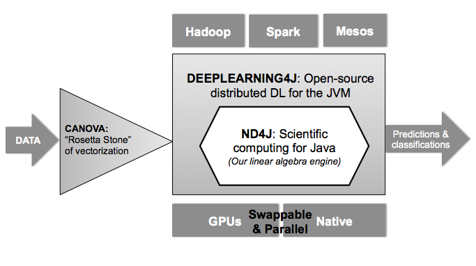

# Deeplearning4jとは何か?

Deeplearning4j（以下DL4J）はJava, Scalaで書かれた世界初商用グレードで、オープンソースの分散ディープラーニング・ライブラリです。Hadoopや Sparkと連携することにより研究、調査目的に加えて実際のビジネスに活かせるように作られています。[Skymind](http://www.skymind.io)は、その商業的サポートを行っています。

DL4Jは最先端のプラグ＆プレイテクノロジーを駆使し、設定よりも非研究者でも手軽にプロトタイピングできるように作られています。DL4Jはスケーラブルでカスタマイズ可能です。Apache 2.0で配布されており、DL4Jの派生物はすべてその著者に帰属します。

弊社の[クイックスタート](./ja-quickstart)にある手順に従いさえすれば、初めてのニューラルネットワークのexampleを数分で使用することができます。

### [Deep Learningのユースケース](./use_cases.html)

* 顔/画像認識
* 音声検索
* 音声の文字化
* スパムフィルタ
* 不正検出 
* レコメンダーシステム（CRM、adtech、解約防止）
* [回帰](./linear-regression.html)

### なぜDeeplearning4jなのか? 

* JavaとScalaにとって汎用的な[n次元配列](http://nd4j.org/ja-index)クラス
* [GPU](http://nd4j.org/gpu_native_backends.html)と連携
* [Hadoop](https://github.com/deeplearning4j/deeplearning4j/tree/master/deeplearning4j-scaleout/hadoop-yarn)や[Spark](./gpu_aws.html)で動作する[スケーラビリティ](./spark.html) 
* [Canova](./canova.html): 機械学習に使用する一般的なベクトル化ツール
* [ND4J: Numpyの2倍ほども迅速な線形代数ライブラリ](http://nd4j.org/benchmarking)

Deeplearning4jは、分散型で、マルチスレッドであるディープラーニングのフレームワークと通常のシングルスレッドであるディープラーニングのフレームワークの両方を持っています。学習はクラスタで行われるため、大量のデータを素早く処理することができます。ネットワークは、[iterative reduce](./iterativereduce.html)経由で学習させます。ネットワークはどれも等しく**Java**や**[Scala](http://nd4j.org/scala.html)**、**[Clojure](https://github.com/wildermuthn/d4lj-iris-example-clj/blob/master/src/dl4j_clj_example/core.clj)**と互換性があります。Deeplearning4jは、オープンスタックでモジュラーコンポーネントとしての役割を担いますが、これは、ディープラーニングのフレームワークとしては、初めて[micro-service architecture（マイクロサービスアーキテクチャ）](http://microservices.io/patterns/microservices.html)に適応したものです。

### DL4Jのニューラルネットワーク

* [制限付きボルツマン・マシン](./ja-restrictedboltzmannmachine.html)
* [畳込みネットワーク](./convolutionalnets.html) （画像）
* [回帰ネットワーク](./usingrnns.html)/[LSTMs](./ja-lstm.html) （時系列、センサーデータ）
* [再帰的オートエンコーダー](https://github.com/deeplearning4j/deeplearning4j/blob/master/deeplearning4j-core/src/main/java/org/deeplearning4j/nn/layers/feedforward/autoencoder/recursive/RecursiveAutoEncoder.java)
* [ディープ・ビリーフ・ネットワーク](./deepbeliefnetwork.html)
* [Deepオートエンコーダー](http://deeplearning4j.org/deepautoencoder.html) （質問-回答/データ圧縮）
* 再帰的ニューラルテンソルネットワーク （シーン、構文解析）
* [Stacked Denoising Autoencoders (sdA)](./stackeddenoisingautoencoder.html)
* 詳細については、[「How to Choose a Neural Net（ニューラルネットワークの選び方）」](./neuralnetworktable.html)をお読みください。

ディープ・ニューラル・ネットワークは、[驚異的な精確さ](./accuracy)を実現します。ニューラルネットワークの概要を簡単に知りたい方は、[こちら](./ja-neuralnet-overview)をお読みください。手短に言うと、Deeplearning4jにより、様々な浅いネットワークを使って「レイヤー（層）」と呼ばれるものを形成し、ディープ・ニューラル・ネットワークを構成することができます。このように柔軟性が高いため、分散型のCPU、GPU、そしてSparkやHadhoopと連携した分散型フレームワークが必要に応じて、制限付きボルツマン・マシン、その他のオートエンコーダー、畳込みネットワーク、または再帰ネットワークを組み合わせることができます。 

以下は、弊社が構築した様々なライブラリ、そして、それらのライブラリがそれらを取り巻くシステムのどこに位置するのかを図式化したものです。

ディープラーニングで学習させるときには非常に多くのパラメタを調整することになります。Deeplearning4jをDIY（自助）ツールとして、Javaや[Scala](https://github.com/deeplearning4j/nd4s)、[Clojure](https://github.com/whilo/clj-nd4j)のプログラマーの方々がご利用できるよう、ご説明して参りました。

分からないことなど質問があれば、是非、[Gitter](https://gitter.im/deeplearning4j/deeplearning4j)にご連絡ください。プレミアムサポートをご希望の方は、[Skymind](http://www.skymind.io/contact/)までご連絡ください。[ND4Jは、Javaベースの科学的計算エンジン](http://nd4j.org/ja-index)で、弊社の行列演算に使われています。弊社にて、大規模な行列で測定したところ、その処理速度は、[Numpyの約2倍の速さ](http://nd4j.org/benchmarking)でした。

### Deeplearning4jのチュートリアル

* [ディープ・ニューラル・ネットワークのご紹介](./ja-neuralnet-overview.html)
* [制限付きボルツマン・マシン](./ja-restrictedboltzmannmachine.html)
* [固有ベクトル、PCA（主成分分析）、エントリピー](./ja-eigenvector.html)
* [Word2vec](./ja-word2vec)
* [畳込みネットワークのチュートリアル](./convolutionalnets.html)
* [LSTMと回帰ネットワークのチュートリアル](./ja-lstm.html)
* [回帰ネットワークをDL4Jに使用しましょう](./usingrnns.html)
* [ディープ・ビリーフ・ネットワークとMNIST](./deepbeliefnetwork)
* [Labeled Faces in the Wildを使った顔再構成](./facial-reconstruction-tutorial.html)
* [Customizing Data Pipelines With Canovaを使った Data Pipelineのカスタマイズ](./image-data-pipeline.html)
* [ディープラーニング用語集](./glossary.html)

### ユーザーの方々の声

      「まるでフランケンシュタイン、あの医者になったような気分だ...」 - Steve D. 
      
      「deeplearning4jを使うことについて、こちら製造部門ではかなりの熱意を持っている。何十億ポンドの市場価値が期待できるからだ。」 -John M.

### Deeplearning4jに貢献したい方々へ

Deeplearning4jに貢献したい開発者の方々は、[Developer's Guide（開発者のガイド）](./devguide.html)をお読みになるといいでしょう。

### Deeplearning4jの研究

* スタンフォード大学の自然言語処理（NLP）:"[Large-Scale Language Classification（大規模な言語分類）](http://nlp.stanford.edu/courses/cs224n/2015/reports/24.pdf)"
