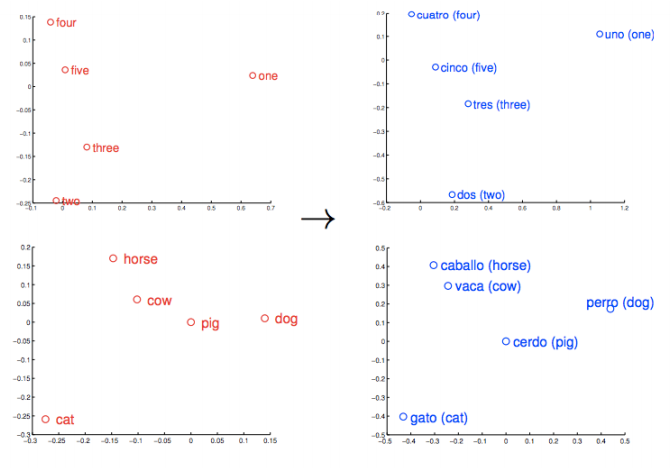

# Word2Vec

目次

* <a href="#intro">Word2Vecとは？</a>
* <a href="#embed">ニューラルネットワーク語の埋め込み</a>
* <a href="#crazy">面白いWord2Vecの出力結果</a>
* <a href="#just">**コードを入れさえすれば大丈夫**</a>
* <a href="#anatomy">Word2vecの構造</a>
* <a href="#setup">セットアップ、ロード、トレーニング</a>
* <a href="#code">コードの使用例</a>
* <a href="#trouble">トラブルシューティング & Word2Vecの調整</a>
* <a href="#use">Word2vecのユースケース</a>
* <a href="#foreign">外国語</a>
* <a href="#glove">GloVe (Global Vectors) & Doc2Vec</a>

## <a name="intro">Word2Vecとは？</a>

Word2vecは、テキスト処理を行い、2層から成るニューラルネットワークです。  テキストコーパスを入力すると、出力結果には、ベクトルのセット、つまりコーパスにある単語の特徴量ベクトル（feature vector）が出されます。Word2vecは、[ディープ・ニューラル・ネットワーク](./ja-neuralnet-overview)ではありませんが、テキストをdeepネットワークが解釈できる数値形式に変えます。 

Word2vecのアプリケーションが適用できる分野は、世間で使われる文の構文解析だけにとどまりません。パターンが識別される可能性のある<a href="#sequence">遺伝子、コード、再生リスト、ソーシャルメディアのグラフ、その他の文字列や記号列</a>にも適用できるのです。[Deeplearning4j](http://deeplearning4j.org/ja-quickstart.html)は、SparkやGPUで動作するJavaや[Scala](./scala.html)用の分散型Word2vecを実装しています。 

Word2vecの目的及び有用性は、類似語のベクトルをベクトルスペースにグループ化することです。つまり、数値に基づいて類似性を検知するのです。 Word2vecは、分散した語の特徴（例えば個々の語のコンテキストなど）の数値表現であるベクトルを作成します。これは人間の介在なしに行われます。 

Word2vec は、十分なデータ、利用例、コンテキストが与えられれば、ある単語の意味の推測を、過去の出現例を基に、かなり高い精度で行うことが出来ます。これらの推測により、ある語と他の語との関連性を確立することができます（例えば、 「man（男性）」と「 boy（少年）」の関係は、 「woman（女性）」と「girl（少女）」の関係に当たるものである。）また、文書をクラスタリングし、トピックによって分類するのにも使用できます。検索や[sentiment analysis（感情分析）](./sentiment_analysis_word2vec.html)、レコメンデーションの際にこれらのクラスタをベースに使うことができます。その分野は、科学的研究、法的発見、電子商取引、顧客関係管理など、幅広く適用できます。 

Word2vecのニューラルネットワークで出力されるものは、語の集合で、それぞれの語にはベクトルが付与されており、これらのベクトルはディープラーニング・ネットワークに入力したり、語と語の間の関係を検知するためにクエリーに使用することができます。 

[コサイン類似度](./glossary.html#cosine)を測定すると、90度としてで表される類似性はなく、完全一致を意味する類似度の1は、0度として表されます。スウェーデンはスウェーデンに等しく、ノルウェーは、スウェーデンとのコサイン距離がどの国よりも最も高く0.760124となっています。 

以下は、Word2vecにより出力された「スウェーデン」と関連した語のリストです。近接性の高いものから順に並べられています。

 

スカンジナビアの国々、いくつかの裕福な北ヨーロッパの国々、ゲルマン系の国々は上位9位に挙がっています。 

## <a name="embed">ニューラルネットワーク語の埋め込み</a>

弊社が語を表現するために使用しているベクトルは、*neural word embeddings（ニューラルネットワーク語の埋め込み）*と呼ばれており、その表現はちょっと変わったものです。あるものが、別のあるものと根本的に異なるものであっても、そのことについて説明します。かつて、Elvis Costelloが、言った「Writing about music is like dancing about architecture.（音楽について書くことは、建築について踊ることと似ている。）」という発言に似ています。 Word2vecは、語を「vectorizes（ベクトル化）」し、コンピューターが自然言語を読み取れるようにします。語の類似性を検知するパワフルな数学演算が実行できるようになったのです。 

つまり、ニューラルネットワーク語の埋め込みとは、数値の付与された語のことなのです。シンプルですが、翻訳とはまた異なります。 

Word2vecは、各語をベクトル化してエンコードするオートエンコーダーと似てはいますが、[制限付きボルツマン・マシン](./ja-restrictedboltzmannmachine.html)のように、入力された語を[再構成](./ja-restrictedboltzmannmachine.html#reconstruct)させてトレーニングするのではなく、word2vecはある語をその語に近い語との関連性に基づいてトレーニングします。 

一般に語のトレーニングには、2つの方法があります。コンテクストを使って対象語を推測する方法（continuous bag of words、CBOWと呼ばれる）、そして、ある語を使って、対象であるコンテクストを推測する方法です。後者の方法は、skip-gramと呼ばれますが、この方法を弊社は使用しています。こちらの方が、大きなデータセットでは、より精確な結果を生み出すからです。

 

ある語に割り当てられた特徴量ベクトルがその語のコンテクストを精確に推測するに使用できない場合、ベクトルのコンポーネントが調整されます。コーパスの中のそれぞれの語が、*教師*のような役割を果たし、 特徴量ベクトルを調整させるためにエラーシグナルを送り返します。コンテクストからある語とある語のベクトルが類似していると判断された場合、ベクトルの数値を調整してより近くに移動させます。

例えば、ゴッホの絵画のひまわりが、カンバスに塗ったオイルの2次元混合で*表現する*1880年代後期におけるパリの3次元空間に存在した植物であるということに似ています。従って、ベクトルに配列された500の数値は、ある語や語の集団を表現することができるのです。

これらのの数値は、500次元のベクトルスペースにそれぞれの語を点に変えて配置していきます。3次元以上の空間は、視覚化することが困難です。（Geoff Hinton氏は、13次元の空間を想像してみてほしいと生徒に言ったことがありますが、生徒たちは、まず最初に3次元をイメージし、その後、13、13、13と何度も繰り返しつぶやくことしかできなかったと回想しています。） 

十分にトレーニングされた語ベクトルのセットは、その空間に互いに似た語を配置します。単語の*oak*、*elm*、*birch*は、ある箇所に集まって配置され、*war*、*conflict*、*strife*は別の箇所に集まって配置されているという感じになるでしょう。 

類似したものや考えは、「近い」ものとして表示されます。それらの相対的な意味が測定可能な距離として翻訳されます。質が量となり、アルゴリズムがその作業を行います。しかし、類似性は、Word2vecが学習できる多くの関連性の単なるベースに過ぎません。例えば、類似性は、ある言語におけるある語とある語の関係を測定し、別の言語にその関連性をマッピングすることもできるのです。

 

これらのベクトルは、より包括的な単語の配列のベースに当たるものです。例えば、Rome、Paris、Berlin、Beijingは互いに近い距離に集まるでしょうが、これらの首都名はそれぞれ、それらの国名とも似た距離にあるでしょう。つまりRome - Italy = Beijing - Chinaとなるでしょう。そして、もし、ローマがイタリアの首都であるを知っていれば、中国の首都の名前を知らなくても、Rome -Italy + Chinaという式を使うと、Beijingという回答に行き着きます。これは決して冗談ではありません。 

 

## <a name="crazy">面白いWord2Vecの出力結果</a>

Word2vecが産出する他の語の関連性を見てみましょう。 

Word2vecは、＋、－、＝などの記号を使わず、論理的類推に使用する表記法を使います。「:」は、「is to（対）」のようなもので、「::」は 「as（等しい）」のようなものです。つまり、 「Rome is to Italy as China is to Beijing（ローマとイタリアの関係は、中国と北京の関係に等しい。）」は、「Rome:Italy::Beijing:China」と表されます。 最後に、今度は「解答」1つをお見せするより、3つの要素を入れると、Word2vecが出力する単語のリストをお見せしましょう。

    king（王）:queen（女王）::man（男性）:[woman（女性）、Attempted abduction（誘拐未遂）、teenager（ティーンエイジャー）、girl（少女）] 
    //ちょっと不思議なものも混じっていますが、だいたい何を指しているか分かります。
    
    China（中国）:Taiwan（台湾）::Russia（ロシア）:[Ukraine（ウクライナ）、Moscow（モスクワ）、Moldova（モルドバ）、Armenia（アルメニア）]
    //2つの大国と、少し疎遠になった小さな隣国。
    
    house（家）:roof（屋根）::castle（城）:[dome（ドーム）、 bell_tower（鐘楼）、 spire、crenellations、turrets（小塔）]
    
    knee（膝）:leg（脚）::elbow（肘）:[forearm（前腕）、 arm（腕）、ulna_bone（尺骨）]
    
    New York Times（ニューヨークタイムズ）:Sulzberger::Fox:[Murdoch, Chernin, Bancroft, Ailes]
    //The Sulzberger-Ochs家は、ニューヨークタイムズ社の所有者であり、経営者です。
    //The Murdoch家は、News Corp.の所有者であるため、Fox Newsを所有者です。 
    //Peter Chernin氏は、13年間、News Corp.'s COO（最高執行責任者）でした。
    //Roger Ailes氏は、Fox Newsの社長です。 
    //The Bancroft家が、 ウォールストリートジャーナルをNews Corpに売却しました。
    
    love（愛）:indifference（無関心）::fear（恐怖）:[apathy（無感動）, callousness（冷淡さ）, timidity（臆病さ）, helplessness（無力さ）, inaction（怠惰）]
    //この語の配列はまるで詩のよう。素晴らしいです。
    
    Donald Trump（ドナルド・トランプ）:Republican（共和党）::Barack Obama（バラク・オバマ）:[Democratic（民主的な）、GOP（共和党のニックネーム）、 Democrats（民主党）、 McCain（マケイン）]
    //興味深いことに、オバマとマケインがライバル関係にあったように、
    //Word2vecは、トランプが共和党という概念とライバル関係にあると見なしているようです。
    
    monkey（猿）:human（人間）::dinosaur（恐竜）:[fossil（化石）、 fossilized（化石化した）、Ice_Age_mammals（氷河時代の哺乳類）、fossilization（化石化）]
    //人間は化石化した猿？残ったのが猿ではなく 
    //人間? 人間は猿に打ち勝った種？
    //氷河時代の哺乳類が恐竜に打ち勝ったように? なるほど。
    
    building（建物）:architect（建築）::software（ソフトウェア）:[programmer（プログラマー）、SecurityCenter（セキュリティ・センター）、WinPcap]

このモデルのトレーニングは、Google News vocabを使って行いました。このGoogle News vocabは、[インポート](#import)して、遊ぶことができます。ちょっと考えてみてください。 Word2vecのアルゴリズムは、英語の文法などというものは何1つ教えてもらっていないないのです。そして世界のことなど何も知りません。規則に基づいた記号の論理や知識グラフなどとも無関係なのです。それでも、ほとんどの知識グラフが1年かけて人間の労働の力を借りながら学習するものよりも多くを、柔軟に、自動的に学習してしまうのです。Google Newsのドキュメントを使ったトレーニング前は白紙の状態ですが、トレーニング後には、人間にとって意味のある複雑な類推を計算することができるのです。 

Word2vecモデルを使って別のタイプのクエリーも行うことができます。いつも鏡のように同じ関係を対応させた2つの類推でなくてもいいのです。 （[以下にその方法をご説明しましょう。](#eval)）

* Geopolitics（地政学）: *Iraq（イラク） - Violence（暴力） = Jordan（ヨルダン）*
* Distinction（区別）: *Human（人間） - Animal（動物） = Ethics（倫理）*
* *President （大統領）- Power（権限） = Prime Minister（首相）*
* *Library（図書館） - Books（本） = Hall（ホール）*
* Analogy（類推）: *Stock Market（株式市場） ≈ Thermometer（温度計）*

ある語と、他の類似語（必ずしも同じ文字を含まない文字で構成された）との近接性の認識を構築することにより、ある語の意味を固定したラベルのようなものから、より柔軟で一般的なものを表現できるようになりました。 

# <a name="just">コードを入れさえすれば大丈夫</a>

## <a name="anatomy">DL4JにおけるWord2vecの構造</a>

以下は、Deeplearning4jの自然言語処理コンポーネントです。

* **SentenceIterator/DocumentIterator**：データセットをイテレートするのに使われます。SentenceIteratorは文字列を返し、DocumentIterator は InputStreamを返します。可能な限りSentenceIteratorを使ってください。
* **Tokenizer/TokenizerFactory**：テキストをトークン化するのに使われます。自然言語処理の用語で、文はトークンの列として表現されます。TokenizerFactory は文をトークン化するための Tokenizer を生成します。 
* **VocabCache**:：単語数、出現数、トークンの集合（この場合は語彙ではなく、出現したトークンの集合）、語彙（[単語のバッグ（多重集合）](./bagofwords-tf-idf.html)と単語ベクトル用のルックアップテーブルの両方に含まれる特徴）といったメタデータを追跡するのに使われます。
* **Inverted Index**: 単語の位置についてのメタデータを保管します。これはデータセットを理解するために使うことが出来ます。Lucene実装によってLuceneインデックス[1]が自動的に作成されます。 

Word2vecは、関連したアルゴリズム群を使いますが、その実装に<a href="../glossary.html#skipgram">Skip-Gram</a>ネガティブ・サンプリングを使用します。

## <a name="setup">Word2Vecのセットアップ</a> 

Mavenを使ってIntelliJに新規プロジェクトを作成します。その方法が分からない方は、[クイックスタート](./quickstart.html)をお読みください。そして、これらのプロパティーと依存関係を、プロジェクトのルートディレクトリにあるPOM.xmlファイルに入れます。（最新のバージョンは[Maven Central](https://search.maven.org/#search%7Cga%7C1%7Cnd4j) でチェックします。)

``` java
                <properties>
                  <nd4j.version>0.4-rc3.9</nd4j.version> //最新バージョンは、Maven Centralで調べましょう!
                  <dl4j.version>0.4-rc3.9</dl4j.version>
                </properties>
                
                <dependencies>
                  <dependency>
                     <groupId>org.deeplearning4j</groupId>
                     <artifactId>deeplearning4j-ui</artifactId>
                     <version>${dl4j.version}</version>
                   </dependency>
                   <dependency>
                     <groupId>org.deeplearning4j</groupId>
                     <artifactId>deeplearning4j-nlp</artifactId>
                     <version>${dl4j.version}</version>
                   </dependency>
                   <dependency>
                     <groupId>org.nd4j</groupId>
                     <artifactId>nd4j-native</artifactId> 
                     <version>${nd4j.version}</version>
                   </dependency>
                </dependencies>
```

### データのローディング

Javaに新しいクラスを作成し、名前を付け、.txtファイルの生の文章をイテレータで巡回します。そして、すべての語を小文字に変換するなど、何らかの処理を行います。 

``` java
        log.info("Load data....");
        ClassPathResource resource = new ClassPathResource("raw_sentences.txt");
        SentenceIterator iter = new LineSentenceIterator(resource.getFile());
        iter.setPreProcessor(new SentencePreProcessor() {
            @Override
            public String preProcess(String sentence) {
                return sentence.toLowerCase();
            }
        });
```

弊社が提供した例にある文章とは異なるテキストファイルをロードさせたい方は、以下のコマンドを使ってください。

``` java
        log.info("Load data....");
        SentenceIterator iter = new LineSentenceIterator(new File("/Users/cvn/Desktop/file.txt"));
        iter.setPreProcessor(new SentencePreProcessor() {
            @Override
            public String preProcess(String sentence) {
                return sentence.toLowerCase();
            }
        });
```

つまり、`ClassPathResource`は削除し、お使いの`.txt`ファイルの絶対パスを`LineSentenceIterator`に入力します。 

``` java
        SentenceIterator iter = new LineSentenceIterator(new File("/your/absolute/file/path/here.txt"));
```

どのディレクトリの絶対パスも、そのディレクトリ内のコマンドラインに`pwd`と入力すると見つかります。そのパスにファイル名を入れると、*完了*です。 

### データのトークン化

Word2vecに入力するものは、文章でなく語であるため、次はデータをトークン化していきます。テキストのトークン化とは、あるテキストを原子レベルの単位にまで分割させることで、例えば、余白にキーを打つたびに新しいトークンが作成されるという意味です。 

``` java
        log.info("Tokenize data....");
        final EndingPreProcessor preProcessor = new EndingPreProcessor();
        TokenizerFactory tokenizer = new DefaultTokenizerFactory();
        tokenizer.setTokenPreProcessor(new TokenPreProcess() {
            @Override
            public String preProcess(String token) {
                token = token.toLowerCase();
                String base = preProcessor.preProcess(token);
                base = base.replaceAll("\\d", "d");
                if (base.endsWith("ly") || base.endsWith("ing"))
                    System.out.println();
                return base;
            }
        });
```

上記のようなコマンド入力により、一行につき一語が表示されます。 

### モデルのトレーニング

データの準備ができたら、Word2vecニューラルネットワークを設定し、トークンを入力していくことができます。 

``` java
        int batchSize = 1000;
        int iterations = 3;
        int layerSize = 150;
        
        log.info("Build model....");
        Word2Vec vec = new Word2Vec.Builder()
                .batchSize(batchSize) //ミニバッチごとの語数
                .minWordFrequency(5) // 
                .useAdaGrad(false) //
                .layerSize(layerSize) // 語の特徴量ベクトルのサイズ
                .iterations(iterations) // トレーニングするイテレーション数
                .learningRate(0.025) // 
                .minLearningRate(1e-3) // 学習率は、語数が減るごとに低下します。これは、学習率の最低限度を表します。
                .negativeSample(10) // 10語のサンプルサイズ
                .iterate(iter) //
                .tokenizerFactory(tokenizer)
                .build();
        vec.fit();
```

この設定は、数多くのハイパーパラメーターに対応しています。以下は、その説明です。 

* *batchSize*とは、1回につき処理される語数です。 
* *minWordFrequency*とは、コーパスにある語が表示される必要のある最低回数です。この例では、もしある語が表示される回数が5回未満であれば、学習されていないと見なされます。ある語の有用な特徴が学習されるには、その語は複数のコンテクストで表示される必要があります。非常に大きなコーパスの場合、その最低値を上げるのが妥当でしょう。
* *useAdaGrad* - Adagradは、各特徴に異なる度合を作ります。これについての詳細はここでは省かせていただきます。 
* *layerSize*は、単語ベクトルの特徴量を指定します。特徴空間にある次元数と同じです。500の特徴量で表現される単語は、500次元空間では、点で表現されます。
* *iterations* 一群のデータにつき、ネットワークの係数をアップデートできる回数です。イテレーションが少な過ぎると、学習できる時間が足りないかもしれないということを意味し、多すぎると、トレーニングが長くなり過ぎるかもしれないことを意味します。
* *learningRate*とは、係数の更新一回につき要されるステップサイズです。そのたびに語が特徴空間で再度配置されます。 
* *minLearningRate*は、学習率の最低限度値です。 トレーニングする語数が減少するにつれて、この学習率も下がります。そして学習率が低下するとネットワークの学習は効率的とは言えなくなります。このため、係数が変化し続けます。 
* *iterate*は、トレーニングを行っているデータセット群がどれかをネットワークに報告します。 
* *tokenizer*は、現在のデータ群から語をネットワークに入力します。 
* *vec.fit()*は、設定済みのネットワークに対し、トレーニングを開始するよう指示します。 

### <a name="eval">モデルの評価、Word2vecの使用</a> 

次に、特徴量ベクトルの質を評価します。 

``` java
        log.info("Evaluate model....");
        double sim = vec.similarity("people", "money");
        log.info("Similarity between people and money:" + sim);
        Collection<String> similar = vec.wordsNearest("day", 10);
        log.info("Similar words to 'day' :" + similar);
        
        //出力結果: [night, week, year, game, season, during, office, until, -]
```

コマンドの`vec.similarity("word1","word2")`により、入力した2つの語のコサイン類似性が出力結果に現れます。数値が、1に近ければ近いほど、ネットワークはそれらの語が類似していると認識しているということになります（上記のスウェーデンとノルウェーの例をご覧ください）。例えば、以下をご覧ください。

``` java
        double cosSim = vec.similarity("day", "night");
        System.out.println(cosSim);
        //出力結果: 0.7704452276229858
```

コマンドの`vec.wordsNearest("word1", numWordsNearest)`を入力すると、意味的に類似した語がネットワーク上に集まって配置されているかを目で調べることができます。近い語の出力語数を2つ目のパラメターのwordsNearestで設定することができます。 例えば、以下をご覧ください。

``` java
        Collection<String> lst3 = vec.wordsNearest("man", 10);
        System.out.println(lst3);
        //出力結果: [director, company, program, former, university, family, group, such, general]
```

### モデルを視覚化

弊社では、[t-SNE](https://lvdmaaten.github.io/tsne/)を使って語の特徴量ベクトルの次元を減少させ、語を2次元、または3次元空間に表示します。 

``` java
        log.info("Plot TSNE....");
        BarnesHutTsne tsne = new BarnesHutTsne.Builder()
                .setMaxIter(1000)
                .stopLyingIteration(250)
                .learningRate(500)
                .useAdaGrad(false)
                .theta(0.5)
                .setMomentum(0.5)
                .normalize(true)
                .usePca(false)
                .build();
        vec.lookupTable().plotVocab(tsne);
```

### モデルの保存、再ロード、使用

モデルを保存したい場合、Deeplearning4jで行う最も一般的な方法は、シリアライゼーションを行うことです。（Javaのシリアライゼーションは、オブジェクトをバイトの*列*に変換するPythonのピクリングに似ています。）

``` java
        log.info("Save vectors....");
        WordVectorSerializer.writeWordVectors(vec, "words.txt");
```

上記のコマンドを使うと、ベクトルが`words.txt`という名のファイルに保存されますが、このファイルは、Word2vecがトレーニングを受けるルートディレクトルに現れるものです。このファイルへの出力結果は、一行につき一語で、隣に数字列も表示されていますが、これはベクトル表現です。

ベクトルを継続して使用するには、以下のような`vec`コマンドを使います。

``` java
        Collection<String> kingList = vec.wordsNearest(Arrays.asList("king", "woman"), Arrays.asList("queen"), 10);
```

Word2vecの算術に一般に使用している語は、"king - queen = man - woman"ですが、その論理的延長は"king - queen + woman = man"です。 

上記の例では、ベクターの`king - queen + woman`に最も近い10語が`man`を含めて出力されます。wordsNearestの最初のパラメターには、`king`や`woman`などのプラス（+）記号が関連した"ポジティブな"語、そして2つ目のパラメタ-は、マイナス（-）記号が関連した"ネガティブな"語が含まれなければなりません（ポジティブやネガティブはここでは感情的な意味はありません）。3つ目のパラメターは、出力させたい最も近い語のリストの長さです。これをコマンドの`import java.util.Arrays;`をファイルのトップに入れるのを忘れないようにしてください。

組み合わせの数は、いくつでも大丈夫ですが、クエリーに入れた語が、コーパス内に十分な頻度で見られた場合のみ、妥当と思われる結果のみを返します。当然、類似語（またはドキュメント）を返す機能が検索とリコメンデーションエンジンのベースとなっています。 

以下のようにベクトルをメモリーに再度ロードさせることができます。

``` java
        WordVectors wordVectors = WordVectorSerializer.loadTxtVectors(new File("words.txt"));
```

そして、Word2vecを参照テーブルとして使用することができます。

``` java
        WeightLookupTable weightLookupTable = wordVectors.lookupTable();
        Iterator<INDArray> vectors = weightLookupTable.vectors();
        INDArray wordVector = wordVectors.getWordVectorMatrix("myword");
        double[] wordVector = wordVectors.getWordVector("myword");
```

ある語が、語彙になければ、Word2vecはゼロと返します。

### <a name="import">Word2vecモデルのインポート</a>

弊社がトレーニングしたネットワークの精確度をテストするために使用する[Google Newsコーパスモデル](https://s3.amazonaws.com/dl4j-distribution/GoogleNews-vectors-negative300.bin.gz)は、S3でホスティングします。ご使用のハードウェアだと大規模なコーパスではトレーニングに時間が掛かりそうな場合は、それをダウンロードするだけで、このような手間を省き、Word2vecモデルを使ってみることができます。 

[C vectors](https://docs.google.com/file/d/0B7XkCwpI5KDYaDBDQm1tZGNDRHc/edit)やGensimmでトレーニングした場合、こちらのコマンドラインでモデルをインポートできます。

``` java
    File gModel = new File("/Developer/Vector Models/GoogleNews-vectors-negative300.bin.gz");
    Word2Vec vec = WordVectorSerializer.loadGoogleModel(gModel, true);
```

インポートしたパッケージに`import java.io.File;`と入力することを忘れないようにしてください。

大規模なモデルでは、ヒープスペースの問題が生じるかもしれません。Googleモデルだと、RAMが10G必要なことがあり、JVMは、RAMが256 MB確保されていないと作動しません。このため、これに応じてヒープスペースを調整する必要が出てくるかもしれません。これは、`bash_profile`ファイル（ [トラブルシューティング](./ja-gettingstarted.html#trouble)をお読みください。）、またはIntelliJで調整可能です。 

    //以下をクリックし、
    IntelliJ Preferences > Compiler > Command Line Options 
    //以下をペーストします。
    -Xms1024m
    -Xmx10g
    -XX:MaxPermSize=2g

### <a name="grams">N-gram & Skip-gram</a>

複数の語が同時にベクトルに読み込まれ、*特定の範囲内で前後に走査します*。これらの範囲は、n-gramといい、n-gramは、 ある言語テキストにある連続的な *n*の列です。単にユニグラム（unigram）、バイグラム（bigram）、トライグラム（trigram）、フォーグラム（four-gram）、ファイブグラム（five-gram）のn番目に当たるバージョンであるに過ぎません。skip-gramは、n-gramからアイテムをドロップさせるだけなのです。 

skip-gram表現は、Mikolovによって普及され、DL4Jに実装されましたが、skip-gram表現を使うと、より一般的なコンテキストが生成されるため、CBOWなど他のモデルより精確だということが実証されています。 

それから、このn-gramは、ニューラルネットワークに使われ、提供された語ベクトルの有意性を学習します。有意性とは、ある特定の大きな意味やラベルの指標（indicator）としての有用性として定義されています。 

### <a name="code">使用例</a>

Word2Vecのセットアップ方法の基本を説明して参りましたが、ここで、DL4JのAPIで使用した[一例](https://github.com/deeplearning4j/dl4j-0.4-examples/blob/master/src/main/java/org/deeplearning4j/examples/word2vec/Word2VecRawTextExample.java)をご紹介しましょう。 

<script src="http://gist-it.appspot.com/https://github.com/deeplearning4j/dl4j-0.4-examples/blob/master/src/main/java/org/deeplearning4j/examples/word2vec/Word2VecRawTextExample.java?slice=22:64"></script>

[クイックスタート](./ja-quickstart.html)にある手順に従った後、この例をIntelliJで開き、それが動作するかを調べてみてください。トレーニングのコーパスにない語でクエリを行うと、Word2vecモデルは結果をゼロと返します。 

### <a name="trouble">トラブルシューティング & Word2Vecの調整</a>

*質問：以下のようなスタックトレースがたくさん表示されるのですが、どうすればいいでしょうか。*

``` java
       java.lang.StackOverflowError: null
       at java.lang.ref.Reference.<init>(Reference.java:254) ~[na:1.8.0_11]
       at java.lang.ref.WeakReference.<init>(WeakReference.java:69) ~[na:1.8.0_11]
       at java.io.ObjectStreamClass$WeakClassKey.<init>(ObjectStreamClass.java:2306) [na:1.8.0_11]
       at java.io.ObjectStreamClass.lookup(ObjectStreamClass.java:322) ~[na:1.8.0_11]
       at java.io.ObjectOutputStream.writeObject0(ObjectOutputStream.java:1134) ~[na:1.8.0_11]
       at java.io.ObjectOutputStream.defaultWriteFields(ObjectOutputStream.java:1548) ~[na:1.8.0_11]
```

*回答：* Word2vecアプリケーションを開始したディレクトリ内を見てください。これは、IntelliJプロジェクトのホームディレクトリかもしれないし、コマンドラインにJavaを入力したディレクトリかもしれません。以下のようなディレクトリがあるはずです。

       ehcache_auto_created2810726831714447871diskstore  
       ehcache_auto_created4727787669919058795diskstore
       ehcache_auto_created3883187579728988119diskstore  
       ehcache_auto_created9101229611634051478diskstore

Word2vecアプリケーションをシャットダウンすると、削除できるか試してみてください。

*質問：生のテキストデータの語すべてがWord2vecオブジェクトに表示されているわけではないようなのですが…*

*回答：* Word2Vecオブジェクトのレイヤーのサイズを**.layerSize()**を入力して上げてみてください。以下はその例です。

``` java
        Word2Vec vec = new Word2Vec.Builder().layerSize(300).windowSize(5)
                .layerSize(300).iterate(iter).tokenizerFactory(t).build();
```

*質問：データをロード方法を教えてください。トレーニングが終わりそうもないのですが、どうしてですか?*

*回答：* すべての文章を*1*文としてロードすると、Word2vecのトレーニングにかなり時間を有する可能性があります。というのは、Word2vecは、文レベルのアルゴリズムで、文と文の境界が非常に重要なため、共起結果の統計は文ごとに集められます。（従って、GloVeの場合、文と文の境界は重要でありません。コーパス全体で共起結果を見るからです。多くのコーパスの場合、平均の文の長さは、6語です。ということは、ウィンドウのサイズが5であれば、（ランダムに言うと）30ラウンドのskip-gram計算が行われるということになります。文と文の境界を指定することを忘れると、10,000語もある1「文」をロードすることになるかもしれません。このような場合、Word2vecは10,000語で構成された1「文」でskip-gramのフルサイクルを行うということになるのです。DL4Jの実装では、ライン1行は文と解釈されます。自身のSentenceIteratorとTokenizerを入れる必要があります。DL4Jは言語というものを知らないため、どこで文が終わるのかを聞きます。UimaSentenceIteratorは、それに対応できる手段の1つであり、文と文の境界の検知にOpenNLPを使用します。

*質問：すべて説明されたように実行しましたが、結果があまり良くないように思えるのですが、どうしてでしょうか。*

*回答：* Ubuntuを使用されている場合は、直列化されたデータが、きちんとロードされていない可能性があります。Ubuntuにはこのような問題があるため、このWordvecのバージョンをLinuxの別のバージョンで試してみることをお勧めします。

### <a name="use">ユースケース</a>

Google Scholarを使うと、Deeplearning4jにWord2vecを実装した調査に関して言及した論文を[こちらに](https://scholar.google.com/scholar?hl=en&q=deeplearning4j+word2vec&btnG=&as_sdt=1%2C5&as_sdtp=)割り出しています。

ベルギーのデータ科学者Kenny Helsens氏は、[Deeplearning4jにWord2vecを実装したもの](http://thinkdata.be/2015/06/10/word2vec-on-raw-omim-database/)をNCBIのOMIM(Online Mendelian Inheritance In Man) データベースに適用し、非小細胞性肺癌で知られる腫瘍遺伝子「alk」に最も近い語を探しました。すると、Word2vecは、"nonsmall, carcinomas, carcinoma, mapdkd."と出力しました。この結果を使って、Helsens氏は、他の種類の癌の表現型と遺伝子型の類推を作り上げることができたのです。これは、Word2vecが大規模なコーパスで学習できる関連性のほんの一例です。重要な病気の新側面の発見のための探索は今始まったばかりです。また、医学にとどまらずその他の分野にも幅広く適用できる可能性を秘めています。

Andreas Klintberg氏は、Deeplearning4jにWord2vecを実装したものをスウェーデン語に適用し、[Mediumに徹底ガイド](https://medium.com/@klintcho/training-a-word2vec-model-for-swedish-e14b15be6cb)を執筆しました。 

また、Word2Vecは、DL4Jが[ディープ・オートエンコーダ](./deepautoencoder)を使って実装するため、情報検索やQAシステム用のテキストベースデータを準備する際にも、特に役立ちます。 

そして、マーケテイング担当者が、リコメンデーションエンジンを構築するために製品間の関係を求めたり、研究者が、ソーシャルグラフを分析して、シングルグループのメンバーやメンバーと場所や財政的支援などと関連する可能性のある関係を求めるのに利用できるでしょう。 

### <a name="patent">GoogleのWord2vec特許</a>

Word2vecは、[語のベクトル表現を計算するメソッド](http://arxiv.org/pdf/1301.3781.pdf)であり、Tomas Mikolov氏の率いるGoogleの研究チームによって発表されました。Googleは、Apache 2.0ライセンスで提供された[Word2vecのオープンソース版をホスティング](https://code.google.com/p/word2vec/)します。2014年にMikolov氏は GoogleからFacebookに移り、2015年5月には[Googleは、そのメソッドで特許を取得](http://patft.uspto.gov/netacgi/nph-Parser?Sect1=PTO2&Sect2=HITOFF&p=1&u=%2Fnetahtml%2FPTO%2Fsearch-bool.html&r=1&f=G&l=50&co1=AND&d=PTXT&s1=9037464&OS=9037464&RS=9037464)しましたが、Apacheのライセンス自体を無効にするものではありません。 

### <a name="foreign">外国語</a>

すべての言語の語は、Word2vecを使ってベクトルに変換され、Deeplearning4jを使ってベクトルが学習されますが、自然言語処理にも各言語に固有な特徴があり、弊社のライブラリ以上のものが必要となる可能性があります。 [Stanford Natural Language Processing Group（スタンフォード大学自然言語処理グループ）](http://nlp.stanford.edu/software/)は、数多くのJavaベースのツールを開発し、トークン化、品詞のタグ付け、[標準中国語](http://nlp.stanford.edu/projects/chinese-nlp.shtml)、アラビア語、フランス語、ドイツ語、スペイン語などの固有表現抽出に使用されています。日本語の場合、[Kuromoji](http://www.atilika.org/)などの自然言語処理ツールが役に立ちます。テキストコーパスなど、その他の外国語のリソースは、[こちら](http://www-nlp.stanford.edu/links/statnlp.html)をお読みください。

### <a name="glove">GloVe: Global Vectors</a>

word2vecにGloVeモデルのロード、保存は以下のように行ってください。

        WordVectors wordVectors = WordVectorSerializer.loadTxtVectors(new File("glove.6B.50d.txt"));

### <a name="sequence">列ベクトル</a>

Deeplearning4jには、[列ベクトル（SequenceVectors）](https://github.com/deeplearning4j/deeplearning4j/blob/b6d1cdd2445b9aa36a7e8230c51cea14d00b37b3/deeplearning4j-scaleout/deeplearning4j-nlp/src/main/java/org/deeplearning4j/models/sequencevectors/SequenceVectors.java)と呼ばれるクラスがあり、語ベクトルを1レベル抽象化したものです。また、ソーシャルメディアプロファイル、商取引、タンパク質など、どんな列からも特徴を抽出することができます。 データが列として記述できれば、AbstractVectorsクラスを使ってskip-gramや階層的ソフトマックスで学習できます。これは、[DeepWalkアルゴリズム](https://github.com/deeplearning4j/deeplearning4j/blob/1ee1666d3a02953fc41ef41542668dd14e020396/deeplearning4j-scaleout/deeplearning4j-graph/src/main/java/org/deeplearning4j/graph/models/DeepWalk/DeepWalk.java)と互換性があり、Deeplearning4jに実装されています。 

### <a name="features">Deeplearning4jに実装されたWord2Vecの特徴</a>

* モデルのシリアライゼーション/デシリアライゼーションを追加した後、ウェイトが更新されます。つまり、200GBの新しいテキストの入力によるモデルの状態の更新を、`loadFullModel`と呼び出し、`TokenizerFactory`と`SentenceIterator`を追加して、されたモデルに`fit()`と呼び出して行うことができるのです。
* 語彙構築のための複数のデータソースのオプションが追加されました。
* エポックやイテレーションはどちらも一般的には「1」ですが、別々に指定させることができます。
* Word2Vecビルダーには`hugeModelExpected`のオプションがあります。この設定を`true`にすると、構築中に語彙は定期的に切り詰められます。
* `minWordFrequency`は、コーパスで稀な語を無視するには役に立ちますが、何語でも除外してカスタマイズすることができます。
* 2つの新しいWordVectorsSerialiaztionメソッド、`writeFullModel`と`loadFullModel`が導入されました。これらのメソッドにより、モデルのフルの状態を保存し、ロードできます。 
* ワークステーションは、一般的に数百万語の語彙を処理すべきものです。Deeplearning4jにWord2vecを実装したものでは、数テラバイトのデータをマシン1台で扱うことができます。大まかにいうと、`vectorSize * 4 * 3 * vocab.size()`となります。

### Doc2vec & その他のリソース

* [DL4J Example of Text Classification With Paragraph Vectors（DL4Jによるパラグラフベクトルを使ったテキスト分類の例）](https://github.com/deeplearning4j/dl4j-0.4-examples/blob/master/src/main/java/org/deeplearning4j/examples/paragraphvectors/ParagraphVectorsClassifierExample.java)
* [Doc2vec, or Paragraph Vectors, With Deeplearning4j（Deeplearning4jを使ったDoc2vec、またはパラグラフベクトル）](./doc2vec.html)
* [Thought Vectors, Natural Language Processing & the Future of AI（思考ベクトル、自然言語処理、AIの未来）](./thoughtvectors.html)
* [Quora: How Does Word2vec Work?（Quora：Word2vecの仕組みはどうなっているの？）](http://www.quora.com/How-does-word2vec-work)
* [Quora: What Are Some Interesting Word2Vec Results?（Quora：Word2Vecの面白い結果にはどんなものがあるの？）](http://www.quora.com/Word2vec/What-are-some-interesting-Word2Vec-results/answer/Omer-Levy)
* [Word2Vec: an introduction（Word2Vecの紹介）](http://www.folgertkarsdorp.nl/word2vec-an-introduction/); Folgert Karsdorp
* [Mikolov's Original Word2vec Code @Google（GoogleでのMikolovのオリジナルWord2vecコード）](https://code.google.com/p/word2vec/)
* [word2vec Explained: Deriving Mikolov et al.’s Negative-Sampling Word-Embedding Method（word2vecの説明：Mikolov et al.のネガティブサンプリング語埋め込みメソッド）](http://arxiv.org/pdf/1402.3722v1.pdf); Yoav Goldberg and Omer Levy
* [Bag of Words & Term Frequency-Inverse Document Frequency (TF-IDF)（CBOW＆単語の出現頻度）](./bagofwords-tf-idf)

### <a name="doctorow">文学作品の中のWord2Vec</a>

    まるで数字が言語であるかのようなのだ。言語の文字それぞれが数字に取って代わり、言語と同じように、みんなそれを同じ意味に解釈する。文字の音も消失し、発音するときの、舌を打つとか、破裂音だとか、口蓋に舌が触れているかとか、オーだったか、アーだったかなどどいう調音方法や、誤った解釈がされる恐れのあるものすべて、音楽や映画が流す偽りのメッセージ、そんな世界は全部、その言葉の訛りと一緒に消えてしまって、全く新しい数字の言語というものが到来し、すべてが壁に書かれたもののように明瞭になる。だから、私が言ったように、数字による文章を読む時代がやって来たんだ。
        -- E.L. Doctorow著「Billy Bathgate（）」
