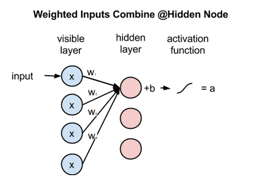
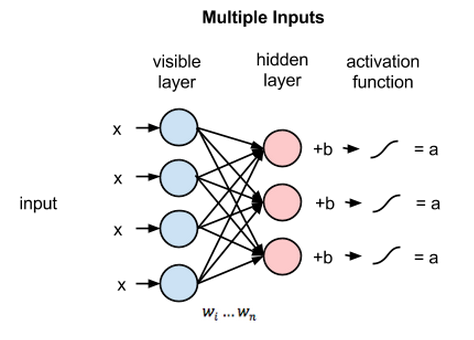
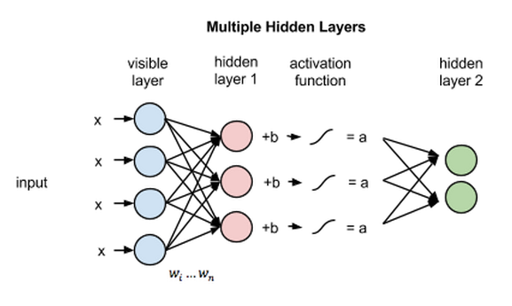
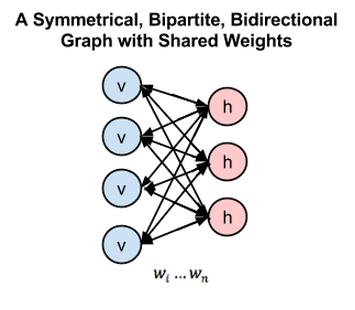

# A Beginner's Tutorial for Restricted Boltzmann Machines

Contents

* <a href="#define">Definition & Structure</a>
* <a href="#reconstruct">Reconstructions</a>
* <a href="#probability">Probability Distributions</a>
* <a href="#code">Code Sample: Initiating an RBM on Iris With DL4J</a>
* <a href="#params">Parameters & k</a>
* <a href="#CRBM">Continuous RBMs</a>
* <a href="#next">Next Steps</a>
* <a href="#resource">Other Resources</a>

## <a name="define">Definition & Structure</a>

Invented by Geoff Hinton, a Restricted Boltzmann machine is an algorithm useful for dimensionality reduction, classification, [regression](./linear-regression.html), collaborative filtering, feature learning and topic modeling. (For more concrete examples of how [neural networks](./neuralnet-overview.html) like RBMs can be employed, please see our page on [use cases](./use_cases.html)).

Given their relative simplicity and historical importance, restricted Boltzmann machines are the first neural network we'll tackle. In the paragraphs below, we describe in diagrams and plain language how they work. 

RBMs are shallow, two-layer neural nets that constitute the building blocks of *deep-belief networks*. The first layer of the RBM is called the visible, or input, layer, and the second is the hidden layer. 

Each circle in the graph above represents a neuron-like unit called a *node*, and nodes are simply where calculations take place. The nodes are connected to each other across layers, but no two nodes of the same layer are linked.

That is, there is no intra-layer communication – this is the *restriction* in a restricted Boltzmann machine. Each node is a locus of computation that processes input, and begins by making [stochastic](./glossary.html#stochasticgradientdescent) decisions about whether to transmit that input or not. (*Stochastic* means “randomly determined”, and in this case, the coefficients that modify inputs are randomly initialized.)

Each visible node takes a low-level feature from an item in the dataset to be learned. For example, from a dataset of grayscale images, each visible node would receive one pixel-value for each pixel in one image. (MNIST images have 784 pixels, so neural nets processing them must have 784 input nodes on the visible layer.)

Now let's follow that single pixel value, *x*, through the two-layer net. At node 1 of the hidden layer, x is multiplied by a *weight* and added to a so-called *bias*. The result of those two operations is fed into an *activation function*, which produces the node's output, or the strength of the signal passing through it, given input x. 

		activation f((weight w * input x) + bias b ) = output a

Next, let's look at how several inputs would combine at one hidden node. Each x is multiplied by a separate weight, the products are summed, added to a bias, and again the result is passed through an activation function to produce the node's output. 

Because inputs from all visible nodes are being passed to all hidden nodes, an RBM can be defined as a *symmetrical bipartite graph*.

*Symmetrical* means that each visible node is connected with each hidden node (see below). *Bipartite* means it has two parts, or layers, and the *graph* is a mathematical term for a web of nodes. 

At each hidden node, each input x is multiplied by its respective weight w. That is, a single input x would have three weights here, making 12 weights altogether (4 input nodes x 3 hidden nodes). The weights between two layers will always form a matrix where the rows are equal to the input nodes, and the columns are equal to the output nodes. 

Each hidden node receives the four inputs multiplied by their respective weights. The sum of those products is again added to a bias (which forces at least some activations to happen), and the result is passed through the activation algorithm producing one output for each hidden node. 

If these two layers were part of a deeper neural network, the outputs of hidden layer no. 1 would be passed as inputs to hidden layer no. 2, and from there through as many hidden layers as you like until they reach a final classifying layer. (For simple feed-forward movements, the RBM nodes function as an *autoencoder* and nothing more.)

## <a name="reconstructions">Reconstructions</a>

But in this introduction to restricted Boltzmann machines, we'll focus on how they learn to reconstruct data by themselves in an unsupervised fashion (unsupervised means without ground-truth labels in a test set), making several forward and backward passes between the visible layer and hidden layer no. 1 without involving a deeper network.

In the reconstruction phase, the activations of hidden layer no. 1 become the input in a backward pass. They are multiplied by the same weights, one per internode edge, just as x was weight-adjusted on the forward pass. The sum of those products is added to a visible-layer bias at each visible node, and the output of those operations is a reconstruction; i.e. an approximation of the original input. This can be represented by the following diagram:

Because the weights of the RBM are randomly initialized, the difference between the reconstructions and the original input is often large. You can think of reconstruction error as the difference between the values of `r` and the input values, and that error is then backpropagated against the RBM's weights, again and again, in an iterative learning process until an error minimum is reached. 

A more thorough explanation of backpropagation is [here](./neuralnet-overview.html#forward). 

As you can see, on its forward pass, an RBM uses inputs to make predictions about node activations, or the [probability of output given a weighted x](https://en.wikipedia.org/wiki/Bayes%27_theorem): `p(a|x; w)`. 

But on its backward pass, when activations are fed in and reconstructions, or guesses about the original data, are spit out, an RBM is attempting to estimate the probability of inputs `x` given activations `a`, which are weighted with the same coefficients as those used on the forward pass. This second phase can be expressed as `p(x|a; w)`. 

Together, those two estimates will lead you to the joint probability distribution of inputs *x* and activations *a*, or `p(x, a)`. 

Reconstruction does something different from regression, which estimates a continous value based on many inputs, and different from classification, which makes guesses about which discrete label to apply to a given input example. 

Reconstruction is making guesses about the probability distribution of the original input; i.e. the values of many varied points at once. This is known as [generative learning](http://cs229.stanford.edu/notes/cs229-notes2.pdf), which must be distinguished from the so-called discriminative learning performed by classification, which maps inputs to labels, effectively drawing lines between groups of data points.  

Let's imagine that both the input data and the reconstructions are normal curves of different shapes, which only partially overlap. 

To measure the distance between its estimated probability distribution and the ground-truth distribution of the input, RBMs use [Kullback Leibler Divergence](https://www.quora.com/What-is-a-good-laymans-explanation-for-the-Kullback-Leibler-Divergence). A thorough explanation of the math can be found on [Wikipedia](https://en.wikipedia.org/wiki/Kullback%E2%80%93Leibler_divergence). 

KL-Divergence measures the non-overlapping, or diverging, areas under the two curves, and an RBM's optimization algorithm attempts to minimize those areas so that the shared weights, when multiplied by activations of hidden layer one, produce a close approximation of the original input. On the left is the probability distibution of a set of original input, *p*, juxtaposed with the reconstructed distribution *q*; on the right, the integration of their differences. 

By iteratively adjusting the weights according to the error they produce, an RBM learns to approximate the original data. You could say that the weights slowly come to reflect the structure of the input, which is encoded in the activations of the first hidden layer. The learning process looks like two probability distributions converging, step by step.

### <a name="probability">Probability Distributions</a> 

Let's talk about probability distributions for a moment. If you're rolling two dice, the probability distribution for all outcomes looks like this:

That is, 7s are the most likely, and any formula attempting to predict the outcome of dice rolls needs to take that into account. 

Languages are specific in the probability distribution of their letters, because each language uses certain letters more than others. In English, the letters *e*, *t* and *a* are the most common, while in Icelandic, the most common letters are *a*, *r* and *n*. Attempting to reconstruct Icelandic with a weight set based on English would lead to a large divergence. 

In the same way, image datasets have unique probability distributions for their pixel values, depending on the kind of images in the set. Pixels values are distributed differently depending on whether the dataset includes MNIST's handwritten numerals:

or the headshots found in Labeled Faces in the Wild:

Imagine for a second that an RBM that was only fed images of elephants and dogs, and which had only two output nodes, one for each animal. The question the RBM is asking itself on the forward pass is: Given these pixels, should my weights send a stronger signal to the elephant node or the dog node? And the question the RBM asks on the backward pass is: Given an elephant, which distribution of pixels should I expect? 

That's joint probability: the simultaneous probability of *x* given *a* and of *a* given *x*, expressed as the shared weights between the two layers of the RBM. 

The process of learning reconstructions is, in a sense, learning which groups of pixels tend to co-occur for a given set of images. The activations produced by nodes of hidden layers deep in the network represent significant co-occurrences; e.g. "nonlinear gray tube + big, floppy ears + wrinkles" might be one.

In the two images above, you see reconstructions learned by Deeplearning4j's implemention of an RBM. These reconstructions represent what the RBM's activations "think" the original data looks like. Geoff Hinton refers to this as a sort of machine "dreaming". When rendered during neural net training, such visualizations are extremely useful heuristics to reassure oneself that the RBM is actually learning. If it is not, then its hyperparameters, discussed below, should be adjusted. 

One last point: You'll notice that RBMs have two biases. This is one aspect that distinguishes them from other autoencoders. The hidden bias helps the RBM produce the activations on the forward pass (since biases impose a floor so that at least some nodes fire no matter how sparse the data), while the *visible* layer's biases help the RBM learn the reconstructions on the backward pass. 

### Multiple Layers

Once this RBM learns the structure of the input data as it relates to the activations of the first hidden layer, then the data is passed one layer down the net. Your first hidden layer takes on the role of visible layer. The activations now effectively become your input, and they are multiplied by weights at the nodes of the second hidden layer, to produce another set of activations. 

This process of creating sequential sets of activations by grouping features and then grouping groups of features is the basis of a *feature hierarchy*, by which neural networks learn more complex and abstract representations of data. 

With each new hidden layer, the weights are adjusted until that layer is able to approximate the input from the previous layer. This is greedy, layerwise and unsupervised pre-training. It requires no labels to improve the weights of the network, which means you can train on unlabeled data, untouched by human hands, which is the vast majority of data in the world. As a rule, algorithms exposed to more data produce more accurate results, and this is one of the reasons why deep-learning algorithms are kicking butt.

Because those weights already approximate the features of the data, they are well positioned to learn better when, in a second step, you try to classify images with the deep-belief network in a subsequent supervised learning stage. 

While RBMs have many uses, proper initialization of weights to facilitate later learning and classification is one of their chief advantages. In a sense, they accomplish something similar to backpropagation: they push weights to model data well. You could say that pre-training and backprop are substitutable means to the same end. 

To synthesize restricted Boltzmann machines in one diagram, here is a symmetrical bipartite and bidirectional graph:

For those interested in studying the structure of RBMs in greater depth, they are one type of [directional, acyclic graph (DAG)](https://en.wikipedia.org/wiki/Directed_acyclic_graph).

### <a name="code">Code Sample: Initiating an RBM on Iris With DL4J</a>

Note how, below, an RBM is simply created as a layer in a `NeuralNetConfiguration`, a parameter fed into a more general class. Likewise, the RBM object is used to store properties like the transforms applied to the visible and hidden layers, Gaussian and Rectified Linear transforms, respectively. 

		public class RBMIrisExample {		
 		
     private static Logger log = LoggerFactory.getLogger(RBMIrisExample.class);		
 		
     public static void main(String[] args) throws IOException {		
         // Customizing params		
         Nd4j.MAX_SLICES_TO_PRINT = -1;		
         Nd4j.MAX_ELEMENTS_PER_SLICE = -1;		
         Nd4j.ENFORCE_NUMERICAL_STABILITY = true;		
         final int numRows = 4;		
         final int numColumns = 1;		
         int outputNum = 10;		
         int numSamples = 150;		
         int batchSize = 150;		
         int iterations = 100;		
         int seed = 123;		
         int listenerFreq = iterations/2;		
 		
         log.info("Load data....");		
         DataSetIterator iter = new IrisDataSetIterator(batchSize, numSamples);		
         // Loads data into generator and format consumable for NN		
         DataSet iris = iter.next();		
 		
         iris.normalizeZeroMeanZeroUnitVariance();		
 		
         log.info("Build model....");		
         NeuralNetConfiguration conf = new NeuralNetConfiguration.Builder().regularization(true)		
                 .miniBatch(true)		
                 // Gaussian for visible; Rectified for hidden		
                 // Set contrastive divergence to 1		
                 .layer(new RBM.Builder().l2(1e-1).l1(1e-3)		
                         .nIn(numRows * numColumns) // Input nodes		
                         .nOut(outputNum) // Output nodes		
                         .activation("relu") // Activation function type		
                         .weightInit(WeightInit.RELU) // Weight initialization		
                         .lossFunction(LossFunctions.LossFunction.RECONSTRUCTION_CROSSENTROPY).k(3)		
                         .hiddenUnit(HiddenUnit.RECTIFIED).visibleUnit(VisibleUnit.GAUSSIAN)		
                         .updater(Updater.ADAGRAD).gradientNormalization(GradientNormalization.ClipL2PerLayer)		
                         .build())		
                 .seed(seed) // Locks in weight initialization for tuning		
                 .iterations(iterations)		
                 .learningRate(1e-3) // Backprop step size		
                 // Speed of modifying learning rate		
                 .optimizationAlgo(OptimizationAlgorithm.LBFGS)		
                         // ^^ Calculates gradients		
                 .build();		
         Layer model = LayerFactories.getFactory(conf.getLayer()).create(conf);		
         model.setListeners(new ScoreIterationListener(listenerFreq));		
 		
         log.info("Evaluate weights....");		
         INDArray w = model.getParam(DefaultParamInitializer.WEIGHT_KEY);		
         log.info("Weights: " + w);		
         log.info("Scaling the dataset");		
         iris.scale();		
         log.info("Train model....");		
         for(int i = 0; i < 20; i++) {		
             log.info("Epoch "+i+":");		
             model.fit(iris.getFeatureMatrix());		
         }		
     }		
     // A single layer learns features unsupervised.	
    }

This is an example of an [RBM processing the Iris flower dataset](./iris-flower-dataset-tutorial.html), which we cover in a separate tutorial. 

## <a name="params">Parameters & k</a>

The variable k is the number of times you run [contrastive divergence](./glossary.html#contrastivedivergence). Contrastive divergence is the method used to calculate the gradient (the slope representing the relationship between a network's weights and its error), without which no learning can occur. 

Each time contrastive divergence is run, it's a sample of the Markov Chain composing the restricted Boltzmann machine. A typical value is 1. 

In the above example, you can see how RBMs can be created as layers with a more general `MultiLayerConfiguration`. After each dot you'll find an additional parameter that affects the structure and performance of a deep neural net. Most of those parameters are defined on this site. 

**weightInit**, or `weightInitialization` represents the starting value of the coefficients that amplify or mute the input signal coming into each node. Proper weight initialization can save you a lot of training time, because training a net is nothing more than adjusting the coefficients to transmit the best signals, which allow the net to classify accurately.

**activationFunction** refers to one of a set of functions that determine the threshold(s) at each node above which a signal is passed through the node, and below which it is blocked. If a node passes the signal through, it is "activated."

**optimizationAlgo** refers to the manner by which a neural net minimizes error, or finds a locus of least error, as it adjusts its coefficients step by step. LBFGS, an acronym whose letters each refer to the last names of its multiple inventors, is an optimization algorithm that makes use of second-order derivatives to calculate the slope of gradient along which coefficients are adjusted.

**regularization** methods such as **l2** help fight overfitting in neural nets. Regularization essentially punishes large coefficients, since large coefficients by definition mean the net has learned to pin its results to a few heavily weighted inputs. Overly strong weights can make it difficult to generalize a net's model when exposed to new data. 

**VisibleUnit/HiddenUnit** refers to the layers of a neural net. The `VisibleUnit`, or layer, is the layer of nodes where input goes in, and the `HiddenUnit` is the layer where those inputs are recombined in more complex features. Both units have their own so-called transforms, in this case Gaussian for the visible and Rectified Linear for the hidden, which map the signal coming out of their respective layers onto a new space. 

**lossFunction** is the way you measure error, or the difference between your net's guesses and the correct labels contained in the test set. Here we use `SQUARED_ERROR`, which makes all errors positive so they can be summed and backpropagated.

**learningRate**, like **momentum**, affects how much the neural net adjusts the coefficients on each iteration as it corrects for error. These two parameters help determine the size of the steps the net takes down the gradient towards a local optimum. A large learning rate will make the net learn fast, and maybe overshoot the optimum. A small learning rate will slow down the learning, which can be inefficient. 

### <a name="CRBM">Continuous RBMs</a>

A continuous restricted Boltzmann machine is a form of RBM that accepts continuous input (i.e. numbers cut finer than integers) via a different type of contrastive divergence sampling. This allows the CRBM to handle things like image pixels or word-count vectors that are normalized to decimals between zero and one.

It should be noted that every layer of a deep-learning net requires four elements: the input, the coefficients, a bias and the transform (activation algorithm). 

The input is the numeric data, a vector, fed to it from the previous layer (or as the original data). The coefficients are the weights given to various features that pass through each node layer. The bias ensures that some nodes in a layer will be activated no matter what. The transformation is an additional algorithm that squashes the data after it passes through each layer in a way that makes gradients easier to compute (and gradients are necessary for a net to learn). 

Those additional algorithms and their combinations can vary layer by layer. 

An effective continuous restricted Boltzmann machine employs a Gaussian transformation on the visible (or input) layer and a rectified-linear-unit transformation on the hidden layer. That's particularly useful in [facial reconstruction](./facial-reconstruction-tutorial.html). For RBMs handling binary data, simply make both transformations binary ones. 

Gaussian transformations do not work well on RBMs' hidden layers. The rectified-linear-unit transformations used instead are capable of representing more features than binary transformations, which we employ on [deep-belief nets](./deepbeliefnetwork.html).

### <a name="next">Conclusions & Next Steps</a>

You can interpret RBMs' output numbers as percentages. Every time the number in the reconstruction is *not zero*, that's a good indication the RBM learned the input. To get another perspective on the mechanisms that make restricted Boltzmann machines tick, click [here](./understandingRBMs.html). 

It should be noted that RBMs do not produce the most stable, consistent results of all shallow, feedforward networks. In many situations, a dense-layer [autoencoder](http://deeplearning4j.org/glossary.html#autoencoder) works better. Indeed, the industry is moving toward tools such as variational autoencoders. 

Next, we'll show you how to implement a [deep-belief network](./deepbeliefnetwork.html), which is simply many restricted Boltzmann machines stacked on top of one another.

### <a name="resources">Other Resources</a>

* [Geoff Hinton on Boltzmann Machines](http://www.scholarpedia.org/article/Boltzmann_machine)
* [Deeplearning.net's Restricted Boltzmann Machine Tutorial](http://deeplearning.net/tutorial/rbm.html)
* [A Practical Guide to Training Restricted Boltzmann Machines](https://www.cs.toronto.edu/~hinton/absps/guideTR.pdf); Geoff Hinton

### Other Beginner's Guides

* [Recurrent Networks/LSTMs](./lstm.html)
* [Neural Networks](./neuralnet-overview.html)
* [Eigenvectors, PCA and Entropy](./eigenvector.html)
* [Neural Networks & Regression](./linear-regression.html)
* [Convolutional Networks](./convolutionalnets.html)
